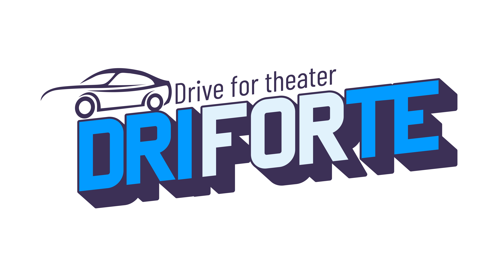

    

	
  
	
	
  
	

### Hi 👋

I am Faisal who has the desire to work as a mobile developer and game developer. I love to learn a new technology, and it keeps me curious about the future.

- 🌱 I’m currently learning MobDev with flutter, and Game Programming with C# on Unity.
- 👯 I’m looking to collaborate on all of you
- 📫 How to reach me: muhamadfaisal280201@gmail.com
- ⚡ Fun fact: I'm a student

### GameDev:
*My first release game on github:*
        <figure>
          <a target="_blank" href="https://github.com/Icankkkk/Driforte.git">
          
          <figcaption></figcaption>
        </figure>
  
### Languages
&nbsp;
&nbsp;
&nbsp;
&nbsp;

### Tools / Tech
&nbsp;
&nbsp;
&nbsp;
&nbsp;
&nbsp;
  
### Now Playing 🎧

    
### Github Statistic

    

## Pinned Repositories

	
    

